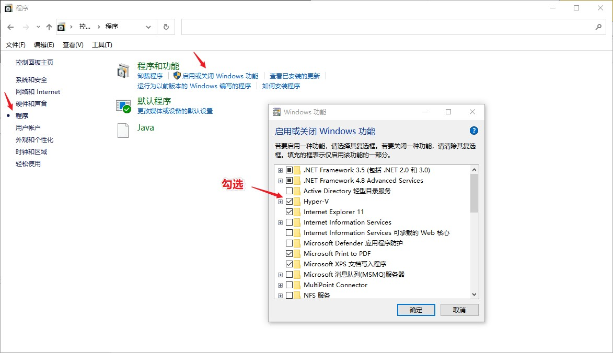
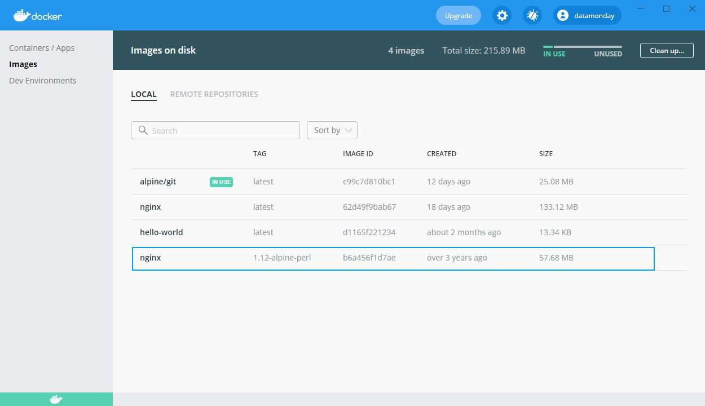

# 1. 容器化简介

## 1.1 Docker 是什么？

Docker 公司运营着 Docker，它的前身是2010年创建的dotCloud公司。该公司为Linux容器（container）构建抽象概念和工具，并使用Linux内核的cgroups（control groups，控制群组）特性和命名空间来降低使用Linux容器的复杂性。

**Docker 是一种用于提供操作系统级别虚拟化的技术——容器 (container)**。但与硬件虚拟化不同。

Docker 使用了Linux内核的资源隔离特性，比如cgroups、内核命名空间（kernel namespace）以及OverlayFS，这些全都位于同一台物理机或虚拟机中。OverlayFS是一种可联合的文件系统，它将一些文件和目录合并成一个，以便运行多个相互隔离和相互包含的应用程序，而这全部都在同一台物理机或虚拟机中完成。

## 1.2 Docker 所解决的问题

在面对具有多个不同的操作系统、操作系统的不同版本，记忆不同版本的库和编程语言的情况时，**设置能够持续提供一致体验的工作环境**几乎是不可能的。但Docker通过**减少活动部件数量的方式**极大限度地解决了这个问题。

Docker 提供了底层系统的统一抽象，这使得开发人员可以非常容易地测试自己的代码。

应用程序代码的新版本部署会带来大量的不确定性。作为运维工程师，将变更限定在配置层面是至关重要的。Docker通过显著减少不确定性的影响面解决了这个问题。

## 1.3 容器与虚拟机之间的区别

<font color=red>**本质区别：容器与宿主机共享相同的内核**。</font>

**Docker仅仅隔离单一的进程**（或者一组进程，这取决于构建镜像的方式），并且所有容器都运行在相同的宿主机系统上。**Docker的隔离特性应用在内核级别，相比于虚拟机（VM），容器的运行并不会导致宿主机上的较大开销**。当一个容器运行时，**所选的一个或一组进程仍旧会运行在相同的宿主机上，而无须虚拟化或模拟任何东西**。


相比之下，**虚拟机管理程序会虚拟化整个系统：从CPU到RAM，再到存储**。**为了支撑这个虚拟化系统，需要安装整个操作系统**。

**虚拟化系统就是运行在一台物理计算机中的完整虚拟化计算机**。


对于虚拟机，还需要额外一个操作系统来运行程序。相比之下，容器对应用程序共享宿主机OS内核，这样免除了额外的OS开销。显著提升了性能，还可以提高资源利用率，并将计算能力的消耗浪费降至最低。

---

# 2. Docker 入门

## 2.1 Win10 安装 Docker

Docker并非虚拟化。为什么在Windows上安装Docker时需要具备这些虚拟化设置所需要的特性呢？

因为Docker依赖于众多特性，比如命名空间和cgroups，而Windows没有提供这些特性。为了绕过这一限制，用于 Windows的Docker会创建一个运行Linux内核的轻量级 Hyper-V容器。

打开Docker官网：https://www.docker.com/get-started 下载并安装。打开Hyper-V：



确定之后，按提示重启。

重启之后，点击Docker对话框中的链接下载wsl_update_x64.msi并安装。重启之后，启动docker，输入以下命令验证是否安装成功。

```shell
docker run --rm hello-world
```

---

## 2.2 Docker 相关术语

### 1）层 (layer)

层就是指应用于Docker镜像的一项修改，它是用Dockerfile中的一个命令来表示的。通常，一个基础镜像产生变化时就会创建一个层。

当Docker构建镜像时，每一层都会堆叠在下一层之上并通过union文件系统合并成单个层。这些层都是使用 sha256 哈希值来唯一区分的。这样就易于重用和缓存它们。

当Docker扫描基础镜像时，它会扫描构成该镜像的所有层的ID，并且开始下载这些层。如果一个层存在于本地缓存中，则会跳过该缓存镜像的下载。

### 2）Docker 镜像

Docker镜像是一种只读模板，是应用程序的基础。它非常类似于将系统设置为预期状态的一段shell脚本。做个类比，他相当于指导制成成品菜肴的食谱。

### 3）Docker 容器

当一个 Docker 镜像在一个宿主计算机中运行时，它会产生一个具有专用命名空间的进程，这就是所谓的Docker容器。<font color=red>**Docker镜像和Docker容器之间的主要区别在于：是否存在被称为容器层的一个浅薄的读写层**。</font>对于容器文件系统的任何变更（如写入或修改）都是在这一可写容器层而非较低的层上完成的。

<font color=blue>**需要理解的一个重要方面：当容器处于运行状态时，变更会应用于容器层，而在容器停止运行或进程被杀掉时，容器层则不会被保存。因此，所有的变更都会丢失**。因此，**有状态的应用程序和那些需要持久化数据的应用程序一开始并不被推荐用做容器化应用程序**。不过，**docker卷**有办法绕开这一限制。</font>

### 4）绑定挂载 和 卷

上文提到，在容器运行时，对于该容易的所有变更都存在于文件系统的容器中。当容器进程被杀掉时，所做的变更就会丢失，并且数据不再可访问。**要将数据写入容器的可写层中，也需要一个存储驱动器来管理文件系统。存储驱动器提供了文件系统的抽象，可用于持久化所做的变更，而这一抽象通常会降低性能**。

出于这些原因，Docker提供了几种不同的方式以便将来自Docker宿主机的数据挂载到一个容器中：卷、绑定挂载以及tmpfs卷。tmpfs卷仅存储在宿主机系统的内存中，而绑定挂载和卷存储在宿主机文件系统中。

### 5）Docker 注册服务器

**Docker 注册服务器就是存储 docker 镜像的地方**，这样它们就能被用作应用程序栈的基础。例如 Docker Hub。

### 6）Dockerfie

Dockerfile是一组指令，告知Docker如何构建一个镜像。一个典型的Dockerfile由以下部分组成：

- FROM 命令，用于告知Docker基础镜像是什么；
- ENV 命令，传递环境变量；
- RUN 指令，运行shell命令；
- CMD 或 ENTRYPOINT 命令，告知 Docker 在启动容器时运行哪个可执行程序。

### 7）Docker 引擎

Docker 引擎是Docker的核心部分，它是一种客户端-服务器应用程序，提供了平台、运行时，以及用于构建和管理Docker镜像、Docker容器等的工具。它提供以下组件：

- Docker守护程序：是一个服务，运行在宿主机计算机的后台中，主要用途是处理大多是Docker命令产生的繁重任务。还可以用于管理和监控Docker容器的其他守护程序进行通信。
- Docker CLI：用户与Docker交互的主要方式，它公开了一组命令。Docker CLI将请求转交给Docker守护程序，然后守护程序会执行必要的操作。
- Docker API：用于与Docker引擎交互。Docker CLI所支持的几乎所有操作都可以通过API完成。

### 8）Docker Compose

**Docker Compose 是用于定义和运行多容器应用程序的工具**。

### 9）Docker Machine

Docker Machine是一款工具，用于在多个虚拟机上安装docker引擎并管理这些主机。

---

## 2.2 使用 Docker 镜像

### 1）安装 jq

为了便于处理json输出，先安装jq，下载地址：

https://stedolan.github.io/jq/download/

本机是Windows，直接下载64位可执行文件，打开PowerShell使用：

```shell
(base) PS D:\Docker> ./jq.exe
```

输出：

```shell
jq - commandline JSON processor [version 1.6]

Usage:  D:\Docker\jq.exe [options] <jq filter> [file...]
        D:\Docker\jq.exe [options] --args <jq filter> [strings...]
        D:\Docker\jq.exe [options] --jsonargs <jq filter> [JSON_TEXTS...]

jq is a tool for processing JSON inputs, applying the given filter to
its JSON text inputs and producing the filter's results as JSON on
standard output.

The simplest filter is ., which copies jq's input to its output
unmodified (except for formatting, but note that IEEE754 is used
for number representation internally, with all that that implies).

For more advanced filters see the jq(1) manpage ("man jq")
and/or https://stedolan.github.io/jq

Example:

        $ echo '{"foo": 0}' | jq .
        {
                "foo": 0
        }

For a listing of options, use D:\Docker\jq.exe --help.
```

### 2）查看可用镜像

```shell
docker image ls
```

输出：

```shell
(base) PS C:\Users\34123> docker image ls
REPOSITORY    TAG       IMAGE ID       CREATED       SIZE
alpine/git    latest    c99c7d810bc1   11 days ago   25.1MB
hello-world   latest    d1165f221234   8 weeks ago   13.3kB
```

### 3）查看 hello-world 镜像

```shell
docker image inspect hello-world
```

```json
[
    {
        "Id": "sha256:d1165f2212346b2bab48cb01c1e39ee8ad1be46b87873d9ca7a4e434980a7726",
        "RepoTags": [
            "hello-world:latest"
        ],
        "RepoDigests": [
            "hello-world@sha256:f2266cbfc127c960fd30e76b7c792dc23b588c0db76233517e1891a4e357d519"
        ],
        "Parent": "",
        "Comment": "",
        "Created": "2021-03-05T23:25:25.230064203Z",
        "Container": "f5a78ef54769bb8490754e9e063a89f90cc8eee6a6c5a0a72655826e99df116e",
        "ContainerConfig": {
            "Hostname": "f5a78ef54769",
            "Domainname": "",
            "User": "",
            "AttachStdin": false,
            "AttachStdout": false,
            "AttachStderr": false,
            "Tty": false,
            "OpenStdin": false,
            "StdinOnce": false,
            "Env": [
                "PATH=/usr/local/sbin:/usr/local/bin:/usr/sbin:/usr/bin:/sbin:/bin"
            ],
            "Cmd": [
                "/bin/sh",
                "-c",
                "#(nop) ",
                "CMD [\"/hello\"]"
            ],
            "Image": "sha256:77fe0a37fa6ce641a004815f2761a9042618557d253f312cd3da61780e372c8f",
            "Volumes": null,
            "WorkingDir": "",
            "Entrypoint": null,
            "OnBuild": null,
            "Labels": {}
        },
        "DockerVersion": "19.03.12",
        "Author": "",
        "Config": {
            "Hostname": "",
            "Domainname": "",
            "User": "",
            "AttachStdin": false,
            "AttachStdout": false,
            "AttachStderr": false,
            "Tty": false,
            "OpenStdin": false,
            "StdinOnce": false,
            "Env": [
                "PATH=/usr/local/sbin:/usr/local/bin:/usr/sbin:/usr/bin:/sbin:/bin"
            ],
            "Cmd": [
                "/hello"
            ],
            "Image": "sha256:77fe0a37fa6ce641a004815f2761a9042618557d253f312cd3da61780e372c8f",
            "Volumes": null,
            "WorkingDir": "",
            "Entrypoint": null,
            "OnBuild": null,
            "Labels": null
        },
        "Architecture": "amd64",
        "Os": "linux",
        "Size": 13336,
        "VirtualSize": 13336,
        "GraphDriver": {
            "Data": {
                "MergedDir": "/var/lib/docker/overlay2/9ac4ac3a3098f4725b1dee1817f6f44f98d38938d18e81d52bc364952856360d/merged",
                "UpperDir": "/var/lib/docker/overlay2/9ac4ac3a3098f4725b1dee1817f6f44f98d38938d18e81d52bc364952856360d/diff",
                "WorkDir": "/var/lib/docker/overlay2/9ac4ac3a3098f4725b1dee1817f6f44f98d38938d18e81d52bc364952856360d/work"
            },
            "Name": "overlay2"
        },
        "RootFS": {
            "Type": "layers",
            "Layers": [
                "sha256:f22b99068db93900abe17f7f5e09ec775c2826ecfe9db961fea68293744144bd"
            ]
        },
        "Metadata": {
            "LastTagTime": "0001-01-01T00:00:00Z"
        }
    }
]
```

### 4）docker inspect

1. 查看环境变量信息：

```shell
# 需要安装 jq，Unix内核系统语句格式：
docker image inspect hello-world | jq .[].Config.Env

# Win系统语句格式：
docker image inspect hello-world | ./jq.exe .[].Config.Env
```

输出：

```json
[
  "PATH=/usr/local/sbin:/usr/local/bin:/usr/sbin:/usr/bin:/sbin:/bin"
]
```

2. 查看容器启动时会运行哪个可执行文件：

```shell
docker image inspect hello-world | ./jq.exe .[].Config.Cmd
```

输出：

```shell
[
  "/hello"
]
```

3. 查看与这些环境变量相关的层：


```shell
docker image inspect hello-world | ./jq.exe .[].RootFS.Layers
```

输出：

```shell
[
  "sha256:f22b99068db93900abe17f7f5e09ec775c2826ecfe9db961fea68293744144bd"
]
```

## 2.3 使用真实环境的 Docker 镜像

现在研究更复杂的镜像——nginx，用于HTTP/S的非常流行的反向代理服务器之一，也可用作负载均衡器和网络服务器。

### 1）拉取nginx镜像

```shell
docker pull nginx
```

输出：

```shell
Using default tag: latest
latest: Pulling from library/nginx
f7ec5a41d630: Pull complete
aa1efa14b3bf: Pull complete
b78b95af9b17: Pull complete
c7d6bca2b8dc: Pull complete
cf16cd8e71e0: Pull complete
0241c68333ef: Pull complete
Digest: sha256:75a55d33ecc73c2a242450a9f1cc858499d468f077ea942867e662c247b5e412
Status: Downloaded newer image for nginx:latest
docker.io/library/nginx:latest
```

**每个Docker镜像都有一个相关的标签（tag），这些标签通常包括名称和版本标记**。虽然并没有强制将版本标签与Docker镜像名称关联到一起，但是**这些标签会让我们更容易地回滚到之前的版本**。没有了标签名称，Docker就必须抓取具有最新标签的镜像。我们也**可以提供一个标签名称来强制抓取一个打过标签的镜像**。

Docker Store 会列出与镜像关联的不同标签。如果正在查找一个特定的标签/版本，最佳的方式就是检查 Docker Store。

尝试拉取指定版本的nginx，使用 `:` 显式地指定版本。


```shell
docker pull nginx:1.12-alpine-perl
```

输出：

```shell
1.12-alpine-perl: Pulling from library/nginx
550fe1bea624: Pull complete
20a55c7b3b0e: Pull complete
552be5624b14: Pull complete
40fc04944e91: Pull complete
Digest: sha256:b7970b06de2b70acca1784ab92fb06d60f4f714e901a55b6b5211c22a446dbd2
Status: Downloaded newer image for nginx:1.12-alpine-perl
docker.io/library/nginx:1.12-alpine-perl
```

打开 docker 客户端查看：



这个不同的十六进制数字就是该镜像的关联层。默认情况下，Docker会从Docker Hub拉取镜像。可以手动指定另一个注册服务器，适用于Docker Hub上未提供却存储在其他位置（例如内部部署的托管 Artifactory）的Docker镜像。为此，必须将注册服务器路径附加到镜像名称之前。

例如，如果注册服务器被托管在docker-private.registry上并且是通过1337端口来提供的，则pull命令为：

```shell
docker pull docker-private.registry:1337/nginx
```

如果注册服务器需要身份验证，可以通过docker login登录该注册服务器：

```shell
docker login docker-private.registry:1337
```

现在已经得到镜像，可以尝试启动一个容器：


```shell
docker run -p 80:80 nginx
```

`-p` 参数会告知docker将Docker容器所公开的端口发布到主机。之后的第一个参数 `80` 是指被发布的Docker宿主机上的端口，而第二个采纳数是指容器内部的端口。

以上命令输出：

```shell
/docker-entrypoint.sh: /docker-entrypoint.d/ is not empty, will attempt to perform configuration
/docker-entrypoint.sh: Looking for shell scripts in /docker-entrypoint.d/
/docker-entrypoint.sh: Launching /docker-entrypoint.d/10-listen-on-ipv6-by-default.sh
10-listen-on-ipv6-by-default.sh: info: Getting the checksum of /etc/nginx/conf.d/default.conf
10-listen-on-ipv6-by-default.sh: info: Enabled listen on IPv6 in /etc/nginx/conf.d/default.conf
/docker-entrypoint.sh: Launching /docker-entrypoint.d/20-envsubst-on-templates.sh
/docker-entrypoint.sh: Launching /docker-entrypoint.d/30-tune-worker-processes.sh
/docker-entrypoint.sh: Configuration complete; ready for start up
```

使用curl请求以查看nginx网络服务器是否正在运行：

```shell
curl http://localhost:80
```

查看镜像发布的端口：

```shell
docker image inspect nginx | ./jq.exe .[].Config.ExposedPorts
```

输出：

```shel
{
  "80/tcp": {}
}
```
### 2）发布修改到端口

修改要将服务发布到Docker宿主机的哪个端口：

```shel
docker run -p 8080:80 nginx
```
输出：

```shel
/docker-entrypoint.sh: /docker-entrypoint.d/ is not empty, will attempt to perform configuration
/docker-entrypoint.sh: Looking for shell scripts in /docker-entrypoint.d/
/docker-entrypoint.sh: Launching /docker-entrypoint.d/10-listen-on-ipv6-by-default.sh
10-listen-on-ipv6-by-default.sh: info: Getting the checksum of /etc/nginx/conf.d/default.conf
10-listen-on-ipv6-by-default.sh: info: Enabled listen on IPv6 in /etc/nginx/conf.d/default.conf
/docker-entrypoint.sh: Launching /docker-entrypoint.d/20-envsubst-on-templates.sh
/docker-entrypoint.sh: Launching /docker-entrypoint.d/30-tune-worker-processes.sh
/docker-entrypoint.sh: Configuration complete; ready for start up
```

尝试对端口8080运行一个curl请求：

```shel
curl http://localhost:8080
```
可以看到与`curl http://localhost:80` 相同的响应输出。

---

### 3）列出正在运行的容器

```shel
docker ps
```
输出：

```shel
CONTAINER ID   IMAGE     COMMAND                  CREATED          STATUS          PORTS                  NAMES
a2eeab4d410f   nginx     "/docker-entrypoint.…"   4 minutes ago    Up 4 minutes    0.0.0.0:8080->80/tcp   bold_saha
a707f0d64539   nginx     "/docker-entrypoint.…"   16 minutes ago   Up 16 minutes   0.0.0.0:80->80/tcp     modest_montalcini
```

注意，`NAMES` 列，Docker会在启动容器时自动分配一个随机名称。也可以提供一个 `-n required-name` 参数，为容器提供一个名称。

### 4）停止运行容器

```shel
# <container-id> 可以通过 docker ps 命令获取
docker stop <container-id>
```
如果成功停止，则docker会返回容器ID。如果容器拒绝停止，可以使用kill命令来强制停止并且杀掉该容器进程：

```shel
docker kill <container-id>
```
### 5）列出所有容器

```shel
docker ps -a
```

### 6）移除容器

```shel
docker rm <container-id>
```
如果有容器引用了当前镜像，则Docker 会拒绝移除。因此，只有移除了所有使用某个特定镜像的容器之后，才能将镜像一并移除。

### 7）列出所有镜像

```shel
docker image ps
```
输出：

```shell
REPOSITORY    TAG       IMAGE ID       CREATED       SIZE
alpine/git    latest    c99c7d810bc1   12 days ago   25.1MB
nginx         latest    62d49f9bab67   2 weeks ago   133MB
hello-world   latest    d1165f221234   8 weeks ago   13.3kB
```

### 8）移除镜像

```shell
docker rmi <image-id>
```


---

> 参考：
> 1. 《Python Docker实战》


